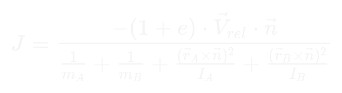

<h1 align="center">Zenoa Engine</h1>

<p align="center">
  2D rigid-body physics engine focused on performance, determinism, and physical stability.<br>
</p>

<p align="center">
  
  
  
  
</p>

<p align="center" style="line-height:1.6;">
  <a href="#collision-handling">Collision Handling</a> •
  <a href="#physics-model">Physics Model</a> •
  <a href="#design-notes">Design Notes</a> •
  <a href="#about">About</a>
</p>


---

### The engine supports:

- Convex polygon and circle bodies  
- Impulse-based collision and friction resolution
- Visual debugging through _SFML_

> As of now ([Zenoa v1](https://github.com/cianleypoldt/RigidBody-Engine/releases/tag/latest)), collision callbacks are not supported.

---

## Build Instructions (Linux)

```bash
sudo pacman -S git clang cmake make sfml glm
git clone https://github.com/cianleypoldt/SAT-Impulse-Physics.git
mkdir Zenoa/build; cd Zenoa/build
cmake ..; make
./Zenoa
```

### Dependencies

- **GLM** – Vector math and linear algebra
- **SFML** – Debug rendering and input

### Usage

- The API is exposed via the interface header: [`src/engine/interface.h`](src/engine/interface.h).
- Usage examples are provided in the [`examples`](examples/) directory.

---

## Collision Handling

### Convex Polygons

Collisions between convex polygons are detected using the **Separating Axis Theorem (SAT)**. Each shape is projected onto axes defined by the **normals of its edges**. If a separating axis exists—i.e., an axis where the projections don’t overlap—the shapes are not colliding. Otherwise, the axis with the smallest overlap is used to compute the **minimum translation vector (MTV)** for resolving the collision.

For a visual overview, see the [Wikipedia article on SAT](https://en.wikipedia.org/wiki/Hyperplane_separation_theorem#Separating_axis_theorem).

If a collision is detected, **face clipping** is used to find precise **contact points**. This involves selecting a reference and incident face, and clipping the incident face against the reference’s side planes.

The resulting contact data, along with **penetration depth**, is used to compute **collision response impulses**, resolving interpenetration while applying realistic forces. Impulse resolution accounts for **mass, restitution**, and **friction**.

### Circle-Polygon Collisions

Collisions between circles and polygons use a **face projection method**. The circle center is projected onto the nearst two polygon edges and it's radius is used to identify contact.


### Walls and Borders

Static boundaries are handled per **deepest-point resolution**, preventing two polygon verticies from recieving the same impulse if both contact the wall in simulation step.

---

## Physics Model

### Impulse Resolution

Zenoa resolves collisions using an **impulse-based solver** that adjusts **linear** and **angular velocities** in proportion to the objects’ **inverse mass**, **moment of inertia**, and the **relative velocity** along the contact normal.

**Impulse formula:**

<p align="center">
  
</p>

**Where:**
- $e$: coefficient of restitution (bounciness)
- $\vec{v}_{rel}$: relative velocity at the contact point
- $\vec{n}$: collision normal
- $m$: mass of the body
- $I$: moment of inertia
- $\vec{r}$: vector from center of mass to contact point

The result is an instantaneous impulse that separates the objects and transfers momentum in a physically consistent way.

### Friction

Here’s a clearer and more concise version:

The engine uses the Coulomb friction model, applying an impulse scaled by the friction coefficient and the relative tangential velocity at the contact point. This impulse is clamped based on the normal impulse, enabling both sliding and static contact behavior.

---

## Design Notes

- Zenoa implements a **Structure of Arrays (SoA)** layout to improve cache efficiency during simulation steps,
- runs on a **fixed timestep** to ensure deterministic behavior and consistent results across platforms,
- stores the entire engine **state in a single context object**, making integration into other systems straightforward and self-contained, and
- uses a custom `entity_list` structure to maintain stable IDs across deletions and avoid costly memory reallocations or shuffling.

---

## About

Here’s the revised version:

Zenoa was created and completed at age 17 as an educational project. It is a functional simulation engine designed for experimenting with and demonstrating real-time physics modeling.

---

## License

[MIT License](LICENSE) © Cian Leypoldt
