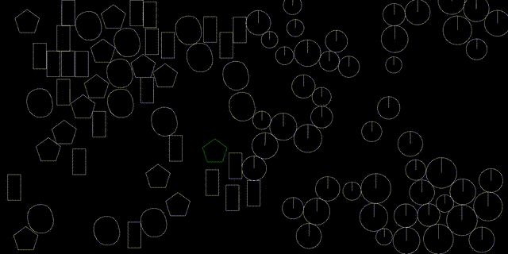
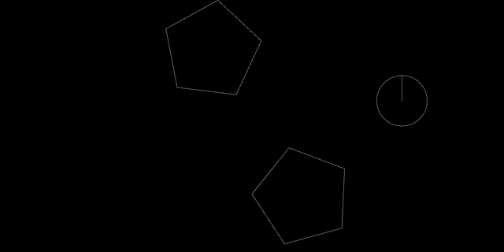

<h1 align="center">Zenoa Engine</h1>

<p align="center">
  2D rigid-body physics engine focused on performance, determinism, and physical stability.<br>
</p>

<p align="center">
  
  
  
  
</p>

<p align="center" style="line-height:1.6;">
  <a href="#collision-handling">Collision Handling</a> •
  <a href="#physics-model">Physics Model</a> •
  <a href="#design-notes">Design Notes</a> •
  <a href="#about">About</a>
</p>



---

### The engine supports:

- Convex polygon and circle bodies  
- Impulse-based collision and friction resolution
- Visual debugging through _SFML_

> As of now ([Zenoa v1](https://github.com/cianleypoldt/RigidBody-Engine/releases/tag/latest)), collision callbacks are not supported.

---

## Build Instructions (Linux)

```bash
sudo pacman -S git clang cmake make sfml glm
git clone https://github.com/cianleypoldt/SAT-Impulse-Physics.git
mkdir Zenoa/build; cd Zenoa/build
cmake ..; make
./Zenoa
```

### Dependencies

- **GLM** – Vector math and linear algebra
- **SFML** – Debug rendering and input

### Usage

- The API is exposed via the interface header: [`src/engine/interface.h`](src/engine/interface.h).
- Usage examples are provided in the [`examples`](examples/) directory.

---

## Collision Handling

### Convex Shapes

Collision detection between convex polygons uses the **Separating Axis Theorem (SAT)**. Contact points are computed using face clipping, and penetration depth is used to generate response impulses.

### Circle–Polygon Interactions

Circles are handled with a **face projection method**, allowing smooth resolution against polygon edges without excessive branching or shape-specific logic.



### Wall and Border Contacts

A simple deepest-point resolution is used to prevent tunneling and maintain expected object boundaries in confined scenes.

---

## Physics Model

### Impulse Resolution

Collisions are resolved using a basic impulse solver. Linear and angular velocities are updated using the relative velocity at the contact point and the combined inverse mass and inertia of the two bodies.

**Impulse formula:**

$$
J = \frac{-(1 + e) \cdot (\vec{v}_{rel} \cdot \vec{n})}{\frac{1}{m_A} + \frac{1}{m_B} + \frac{(\vec{r}_A \times \vec{n})^2}{I_A} + \frac{(\vec{r}_B \times \vec{n})^2}{I_B}}
$$

**Where:**

- $e$ is the restitution coefficient
- $\vec{v}_{rel}$ is the relative velocity at the contact
- $\vec{n}$ is the contact normal
- $m$, $I$ are the mass and moment of inertia

### Friction

Basic Coulomb friction is supported. Tangential impulses are clamped relative to the normal impulse, allowing simple sliding and resting contact behavior.

---

## Design Notes

- Uses **Structure of Arrays (SoA)** for better cache behavior during updates.
- Simulation runs on a **fixed timestep** for consistency and repeatability.
- Engine **state** is stored in a **self-contained context**, allowing integration into other applications or environments.
- Custom `entity_list` structure keeps all IDs consistent through deletions and avoids large memory moves or resizes.

---

## About

Zenoa is an ongoing physics engine project developed at age 17 with a focus on performance, determinism, and low-level system design—built both as a functional engine and as a deeper study in real-time simulation.

---

## License

[MIT License](https://opensource.org/licenses/MIT) © Cian Leypoldt
